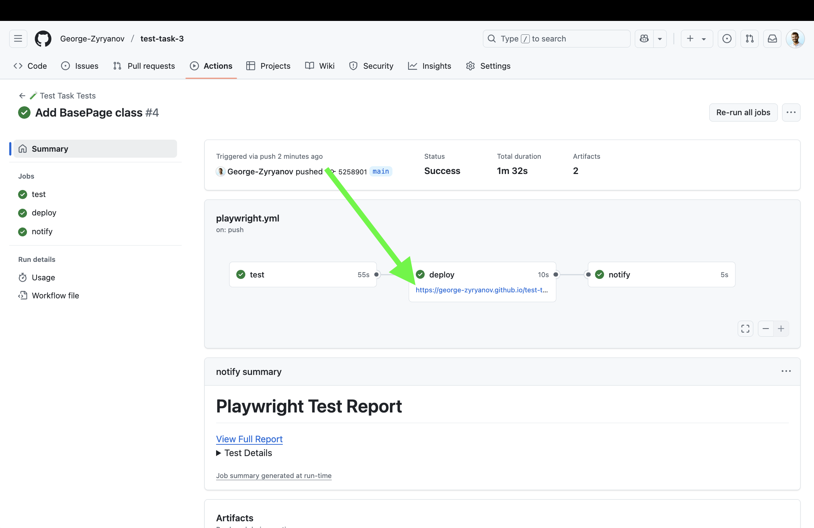

# IMDb Test Automation Project

Automated tests for IMDb website using Playwright with TypeScript, following Page Object Model design pattern.

## 🚀 Project Structure
```
├── tests/                  # Test specifications
├── pageFactory/           # Page Objects
├── lib/                   # Test utilities
└── playwright.config.ts   # Configuration
```

## 🛠️ Setup
```bash
npm install
npx playwright install
```

## 🧪 Running Tests
```bash
# Run all tests
npx playwright test

# Run with UI
npx playwright test --ui

# Run specific test
npx playwright test tests/searchTitle.spec.ts
```

## 📸 Screenshots

*Test Report Example* 

## 📋 Test Scenarios
1. **Search and Validate Movie**
   - Search for a movie title
   - Validate movie details

2. **Top 250 Movies Navigation**
   - Navigate to Top 250 Movies
   - Validate movie details (title, rating, year)

## 🏗️ Features
- Page Object Model
- Cross-browser testing
- HTML reporting
- TypeScript

## 📝 Notes
- Tests run on Chromium
- Reports could be viewed in GitHub Pages, see in screenshots

